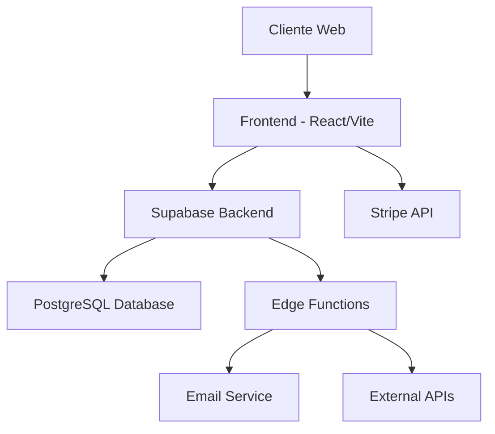
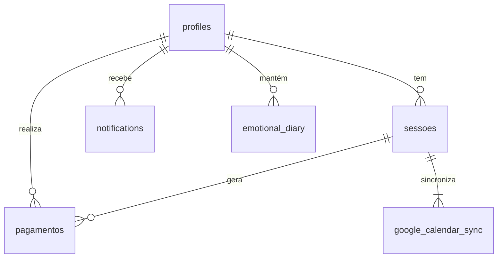

# Além do Apego - Documentação Técnica
Plataforma de Agendamento Terapêutico

## Sumário
1. [Visão Geral do Projeto](#1-visão-geral-do-projeto)
2. [Arquitetura do Sistema](#2-arquitetura-do-sistema)
3. [Estrutura do Banco de Dados](#3-estrutura-do-banco-de-dados)
4. [Mapa de Navegação](#4-mapa-de-navegação)
5. [API e Endpoints](#5-api-e-endpoints)
6. [Testes](#6-testes)
7. [Deploy e Configuração](#7-deploy-e-configuração)
8. [Segurança](#8-segurança)
9. [Logs e Monitoramento](#9-logs-e-monitoramento)
10. [Roadmap](#10-roadmap)

## 1. Visão Geral do Projeto

### 1.1 Identificação
- **Nome:** Além do Apego
- **Tipo:** Plataforma de Agendamento Terapêutico
- **Versão:** 1.0.0

### 1.2 Objetivo
Fornecer uma plataforma completa para terapeutas gerenciarem seus atendimentos, incluindo agendamento de sessões, gestão de pagamentos e interação com clientes.

### 1.3 Público-Alvo
- Terapeutas autônomos
- Pequenas clínicas terapêuticas
- Pacientes/Clientes que buscam atendimento

### 1.4 Funcionalidades Principais
- Agendamento de sessões
  - Calendário interativo
  - Seleção de horários disponíveis
  - Confirmação automática
  - Lembretes por email
  - Sincronização com Google Calendar
  
- Gestão de clientes
  - Perfis detalhados
  - Histórico de sessões
  - Notas de progresso
  - Documentos anexados
  - Histórico de pagamentos

- Processamento de pagamentos via Stripe
  - Múltiplos métodos de pagamento
  - Faturas automáticas
  - Relatórios financeiros
  - Gestão de reembolsos
  - Recibos digitais

- Diário emocional para clientes
  - Registro diário de humor
  - Upload de áudios/textos
  - Visualização de progresso
  - Compartilhamento com terapeuta
  - Exportação de dados

- Dashboard administrativo
  - Métricas em tempo real
  - Gestão financeira
  - Relatórios personalizados
  - Controle de agenda
  - Análise de performance

### 1.5 Diferenciais Competitivos
1. **Experiência Personalizada**
   - Interface intuitiva adaptada para terapeutas
   - Fluxos otimizados para agendamento
   - Design centrado no usuário

2. **Integração Completa**
   - Sistema unificado de pagamentos
   - Sincronização com calendário
   - Notificações multicanal

3. **Segurança e Privacidade**
   - Criptografia de dados sensíveis
   - Conformidade com LGPD
   - Backups automáticos

4. **Ferramentas Especializadas**
   - Diário emocional integrado
   - Prontuário digital
   - Análise de progresso

5. **Escalabilidade**
   - Arquitetura serverless
   - Performance otimizada
   - Multitenancy preparado

## 2. Arquitetura do Sistema

### 2.1 Visão Geral da Arquitetura


### 2.2 Componentes Principais

#### Frontend (Client-Side)
- **Framework:** React 18
- **Build Tool:** Vite
- **UI Framework:** TailwindCSS + Shadcn/UI
- **State Management:** React Query + Context API
- **Roteamento:** React Router v6

#### Backend (Supabase)
- **Database:** PostgreSQL
- **Authentication:** Supabase Auth
- **Storage:** Supabase Storage
- **Serverless Functions:** Edge Functions
- **Real-time:** Supabase Realtime

#### Serviços Externos
- **Pagamentos:** Stripe
- **Deploy Frontend:** Vercel
- **Deploy Backend:** Supabase Cloud
- **Email:** Resend

### 2.3 Tecnologias Utilizadas

#### Frontend
```json
{
  "dependencies": {
    "react": "^18.3.1",
    "react-router-dom": "^6.26.2",
    "@tanstack/react-query": "^5.56.2",
    "tailwindcss": "latest",
    "@stripe/stripe-js": "^2.4.0",
    "@supabase/supabase-js": "^2.48.1"
  }
}
```

#### Backend (Supabase)
- PostgreSQL 15+
- Node.js 18+ (Edge Functions)
- TypeScript 5+

## 3. Estrutura do Banco de Dados

### 3.1 Diagrama ER


### 3.2 Tabelas Principais

#### profiles
```sql
CREATE TABLE profiles (
  id UUID PRIMARY KEY REFERENCES auth.users,
  email TEXT,
  full_name TEXT,
  role TEXT,
  status TEXT DEFAULT 'active',
  created_at TIMESTAMPTZ DEFAULT NOW(),
  avatar_url TEXT,
  preferences JSONB DEFAULT '{}'
);
```

#### sessoes
```sql
CREATE TABLE sessoes (
  id UUID PRIMARY KEY DEFAULT gen_random_uuid(),
  cliente_id UUID REFERENCES profiles(id),
  data_hora TIMESTAMPTZ NOT NULL,
  tipo_sessao TEXT NOT NULL,
  status TEXT DEFAULT 'agendado',
  valor NUMERIC,
  status_pagamento TEXT DEFAULT 'pendente',
  notas TEXT,
  created_at TIMESTAMPTZ DEFAULT NOW(),
  updated_at TIMESTAMPTZ DEFAULT NOW()
);
```

#### pagamentos
```sql
CREATE TABLE pagamentos (
  id UUID PRIMARY KEY DEFAULT gen_random_uuid(),
  sessao_id UUID REFERENCES sessoes(id),
  cliente_id UUID REFERENCES profiles(id),
  valor NUMERIC NOT NULL,
  status TEXT DEFAULT 'pendente',
  metodo_pagamento TEXT,
  data_pagamento TIMESTAMPTZ,
  created_at TIMESTAMPTZ DEFAULT NOW()
);
```

### 3.3 Políticas de Segurança (RLS)

#### Profiles
```sql
-- Usuários podem ler seu próprio perfil
CREATE POLICY "Users can read own profile"
ON profiles FOR SELECT
USING (auth.uid() = id);

-- Usuários podem atualizar seu próprio perfil
CREATE POLICY "Users can update own profile"
ON profiles FOR UPDATE
USING (auth.uid() = id);
```

#### Sessões
```sql
-- Terapeutas podem ver todas as sessões
CREATE POLICY "Therapists can view all sessions"
ON sessoes FOR SELECT
USING (EXISTS (
  SELECT 1 FROM profiles
  WHERE id = auth.uid() AND role = 'terapeuta'
));

-- Clientes só veem suas próprias sessões
CREATE POLICY "Clients can only view own sessions"
ON sessoes FOR SELECT
USING (cliente_id = auth.uid());
```

### 3.4 Índices e Performance

#### Índices Principais
```sql
-- Otimização de busca por sessões
CREATE INDEX idx_sessoes_cliente_data ON sessoes (cliente_id, data_hora);

-- Otimização de busca por pagamentos
CREATE INDEX idx_pagamentos_status ON pagamentos (status, data_pagamento);

-- Otimização de busca por notificações
CREATE INDEX idx_notifications_user ON notifications (user_id, scheduled_for);
```

#### Constraints e Validações
```sql
-- Garantir valores válidos para status
ALTER TABLE sessoes 
ADD CONSTRAINT valid_session_status 
CHECK (status IN ('agendado', 'confirmado', 'cancelado', 'finalizado'));

-- Garantir data_hora futura para novas sessões
ALTER TABLE sessoes 
ADD CONSTRAINT future_session_date 
CHECK (data_hora > CURRENT_TIMESTAMP);
```

## 4. Mapa de Navegação

### 4.1 Estrutura de Rotas

```typescript
const routes = [
  {
    path: "/",
    element: <Root />,
    children: [
      { path: "/auth", element: <Auth /> },
      {
        path: "/dashboard",
        element: <Dashboard />,
        children: [
          { path: "sessions", element: <Sessions /> },
          { path: "clients", element: <Clients /> },
          { path: "payments", element: <Payments /> },
          { path: "reports", element: <Reports /> }
        ]
      },
      {
        path: "/client-dashboard",
        element: <ClientDashboard />,
        children: [
          { path: "schedule", element: <ClientSchedule /> },
          { path: "sessions", element: <ClientSessions /> },
          { path: "diary", element: <EmotionalDiary /> },
          { path: "payments", element: <ClientPayments /> }
        ]
      }
    ]
  }
];
```

### 4.2 Fluxos Principais

#### Fluxo de Agendamento
1. Cliente acessa /client-dashboard/schedule
2. Seleciona data/hora disponível
3. Confirma agendamento
4. Recebe notificação por email
5. Realiza pagamento (opcional)

#### Fluxo de Pagamento
1. Cliente seleciona sessão para pagar
2. Escolhe método de pagamento
3. Processa pagamento via Stripe
4. Recebe confirmação
5. Status da sessão é atualizado

## 5. API e Endpoints

### 5.1 Autenticação

```typescript
// Login
const { data, error } = await supabase.auth.signInWithPassword({
  email: string,
  password: string
});

// Registro
const { data, error } = await supabase.auth.signUp({
  email: string,
  password: string,
  options: {
    data: {
      full_name: string,
      role: 'cliente' | 'terapeuta'
    }
  }
});
```

### 5.2 Sessões API

#### Criar Sessão
```typescript
const { data, error } = await supabase
  .from('sessoes')
  .insert({
    cliente_id: string,
    data_hora: string,
    tipo_sessao: string,
    valor: number
  })
  .select()
  .single();
```

#### Listar Sessões
```typescript
const { data, error } = await supabase
  .from('sessoes')
  .select(`
    *,
    profiles:cliente_id (*)
  `)
  .order('data_hora', { ascending: true });
```

### 5.3 Edge Functions

#### Processar Pagamento
```typescript
// /functions/process-payment/index.ts
serve(async (req) => {
  const { session_id, payment_method } = await req.json();
  // Processo de pagamento via Stripe
  // Atualização do status no banco
  return new Response(JSON.stringify({ success: true }));
});
```

## 6. Testes

### 6.1 Testes Unitários

```typescript
// SessionForm.test.tsx
describe('SessionForm', () => {
  it('should validate required fields', () => {
    render(<SessionForm />);
    fireEvent.click(screen.getByText('Criar Sessão'));
    expect(screen.getByText('Data é obrigatória')).toBeInTheDocument();
  });
});
```

### 6.2 Testes de Integração

```typescript
describe('Agendamento Flow', () => {
  it('should create session and send notification', async () => {
    // Setup
    const user = await createTestUser();
    const session = await createTestSession(user.id);
    
    // Verify
    expect(session.status).toBe('agendado');
    expect(await getNotifications(user.id)).toHaveLength(1);
  });
});
```

### 6.3 Testes E2E
Utilizar Cypress para testes end-to-end, cobrindo os principais fluxos:
- Login/Registro
- Agendamento
- Pagamento
- Cancelamento

## 7. Deploy e Configuração

### 7.1 Variáveis de Ambiente

```bash
# Supabase
VITE_SUPABASE_URL=
VITE_SUPABASE_ANON_KEY=

# Stripe
VITE_STRIPE_PUBLIC_KEY=
STRIPE_SECRET_KEY=

# Email
RESEND_API_KEY=
```

### 7.2 Deploy Frontend (Vercel)

```bash
# Build
npm run build

# Deploy
vercel deploy
```

### 7.3 Deploy Edge Functions

```bash
# Deploy todas as functions
supabase functions deploy

# Deploy função específica
supabase functions deploy process-payment
```

## 8. Segurança

### 8.1 Autenticação
- JWT tokens via Supabase Auth
- Refresh tokens automáticos
- Sessions persistentes

### 8.2 Row Level Security
Todas as tabelas têm RLS habilitado com políticas específicas:
- Clientes só acessam seus próprios dados
- Terapeutas têm acesso controlado
- Dados sensíveis são protegidos

### 8.3 CORS e Headers
```typescript
const corsHeaders = {
  'Access-Control-Allow-Origin': '*',
  'Access-Control-Allow-Headers': 'authorization, x-client-info, apikey',
};
```

## 9. Logs e Monitoramento

### 9.1 Estrutura de Logs
```typescript
interface LogEntry {
  timestamp: string;
  level: 'info' | 'warn' | 'error';
  action: string;
  user_id?: string;
  metadata?: Record<string, any>;
}
```

### 9.2 Monitoramento
- Supabase Dashboard para métricas de banco
- Vercel Analytics para frontend
- Stripe Dashboard para pagamentos

## 10. Roadmap

### 10.1 Próximas Funcionalidades
1. Videoconferência integrada
2. App mobile
3. Integração com prontuário eletrônico
4. Sistema de avaliações e feedback

### 10.2 Melhorias Técnicas
1. Implementar Cache com Redis
2. Migrar para microsserviços
3. Adicionar testes automatizados
4. Implementar CI/CD completo

### 10.3 Escalabilidade
- Planejamento para múltiplos terapeutas
- Sistema de clínicas
- Marketplace de serviços

## Apêndice A: Comandos Úteis

```bash
# Desenvolvimento local
npm run dev

# Build
npm run build

# Testes
npm run test

# Deploy
npm run deploy
```

## Apêndice B: Troubleshooting

### Problemas Comuns

1. Erro de autenticação
```typescript
// Verificar sessão
const { data: { session } } = await supabase.auth.getSession();
if (!session) {
  // Redirecionar para login
}
```

2. Erro de permissão no banco
```sql
-- Verificar políticas
SELECT * FROM pg_policies WHERE tablename = 'sessoes';
```

3. Erro no processamento de pagamento
```typescript
try {
  const paymentIntent = await stripe.paymentIntents.create({
    amount,
    currency: 'brl',
    payment_method: paymentMethodId,
  });
} catch (error) {
  console.error('Stripe error:', error);
}
```

## Apêndice C: Configuração de Ambiente

### C.1 Requisitos de Sistema
- Node.js 18+
- npm 9+
- Git
- PostgreSQL 15+ (desenvolvimento local)

### C.2 Configuração Local
```bash
# Clone o repositório
git clone git@github.com:usuario/alem-do-apego.git

# Instale as dependências
cd alem-do-apego
npm install

# Configure as variáveis de ambiente
cp .env.example .env
# Edite .env com suas credenciais

# Inicie o servidor de desenvolvimento
npm run dev
```

### C.3 Scripts de Manutenção
```bash
# Atualizar dependências
npm update

# Limpar cache
npm run clean

# Verificar tipos
npm run typecheck

# Executar linter
npm run lint
```

### C.4 Backups e Recuperação
```bash
# Backup do banco
pg_dump -U postgres alem_do_apego > backup.sql

# Restaurar backup
psql -U postgres alem_do_apego < backup.sql
```

---
Última atualização: Fevereiro 2024

## 7.4 Pipeline CI/CD

```yaml
name: CI/CD Pipeline

on:
  push:
    branches: [ main ]
  pull_request:
    branches: [ main ]

jobs:
  test:
    runs-on: ubuntu-latest
    steps:
      - uses: actions/checkout@v2
      - name: Run Tests
        run: npm test

  deploy:
    needs: test
    runs-on: ubuntu-latest
    steps:
      - uses: actions/checkout@v2
      - name: Deploy to Vercel
        run: vercel --prod
```
